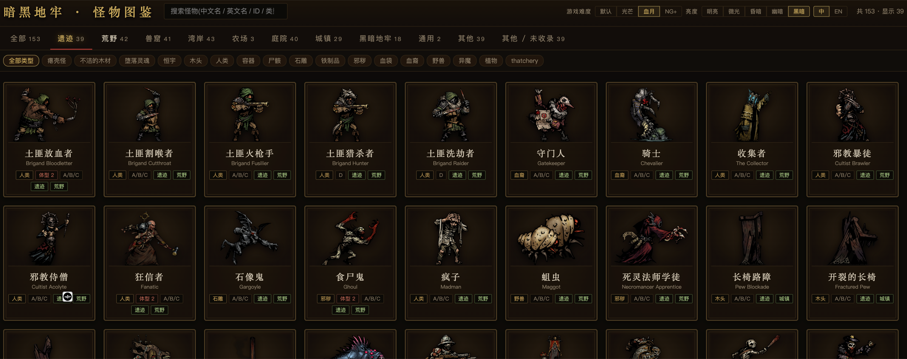

# 暗黑地牢 1 工具集(Darkest Dungeon 1 Toolbox)

围绕《Darkest Dungeon》本体的三个子项目 monorepo:**怪物图鉴**(纯前端)、
**darkest_mcp**(游戏数据 MCP 服务)、**DD1SaveManager**(本地存档管理器)。



## 项目一览

| 子项目 | 是什么 | 技术栈 |
|---|---|---|
| [`bestiary/`](bestiary/) | **怪物图鉴**:本体 + DLC 共 153 个怪物的可检索卡片墙;中英双语、档位技能、站位/打击可视化、状态图标、原画灯箱 | Vue 3 + Vite + TS |
| [`darkest_mcp/`](darkest_mcp/) | **DD1 数据 MCP 服务**:7 个工具(浏览/搜索/实体/读文件/本地化/格式文档/mod 校验),是本仓库游戏格式知识的唯一所有者(ADR-0005) | TS + MCP stdio |
| [`DD1SaveManager/`](DD1SaveManager/) | **存档管理器**:备份/恢复/克隆 Steam 本地存档的绿色单文件桌面程序(附编译产物) | C# WinForms |

## 数据流(单向)

```
游戏文件 → darkest_mcp `npm run export` → bestiary/public/data(入库) → bestiary 前端
                                                       └→ bestiary `npm run build`(wiki 贴图装饰)
```

bestiary 是纯 JSON 消费者:仓库内没有任何游戏解析代码,部署不依赖游戏安装;
游戏更新后只需在 darkest_mcp 重新导出、bestiary 重建即可(见 ADR-0003/0005)。

## 快速开始

**bestiary(图鉴前端)**

```bash
cd bestiary
npm install
npm run dev        # Vite 开发服务器
npm test           # vitest 9 用例
```

**darkest_mcp(MCP 服务,需本机装有 DD1)**

```bash
cd darkest_mcp
npm install
npm run build      # tsc → dist/index.js(stdio MCP 入口)
npm test           # vitest 17 用例(合成 fixture,不依赖游戏)
npm run smoke      # 端到端冒烟(需游戏安装,自动探测 Steam 目录或设 DD_GAME_DIR)
npm run export     # 重新生成图鉴数据 → bestiary/public/data
```

**DD1SaveManager**:直接双击 `DD1SaveManager/DD1SaveManager.exe`,详见[其 README](DD1SaveManager/README.md)。

## 文档

- [`CONTEXT.md`](CONTEXT.md) — 领域词汇表与模块地图(讨论/提交请用这里的词)
- [`docs/adr/`](docs/adr/) — 架构决策记录 ADR-0001 ~ 0005
- [`deploy/`](deploy/) — Docker 构建与部署(home03:8899),流程见 [deploy/README.md](deploy/README.md)

## 数据与图片来源说明

- 图鉴 JSON 数据由 darkest_mcp 从本机游戏安装导出,数据版权归 **Red Hook Studios** 所有。
- 怪物原画与状态图标来自 [Darkest Dungeon Wiki](https://darkestdungeon.fandom.com/)(CC BY-SA),
  仅作图鉴展示用途,如有侵权请联系移除。
